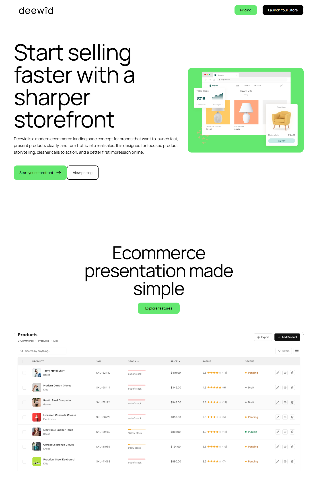

# Deewid Landing V1

First public version of Deewid, a static ecommerce landing page built with HTML, CSS, and JavaScript.



## Overview

- Static ecommerce landing page
- No backend required
- Local assets included
- Compatible with GitHub Pages

## Stack

- HTML
- Compiled CSS
- JavaScript

## Run locally

```bash
npm install
npm run watch
```

## Related versions

- `deewid-landing-v1`
  - Repo: `https://github.com/adrielzimbril/deewid-landing-v1`
  - Preview: `https://adrielzimbril.github.io/deewid-landing-v1/`
- `deewid-landing-v2`
  - Repo: `https://github.com/adrielzimbril/deewid-landing-v2`
  - Preview: `https://adrielzimbril.github.io/deewid-landing-v2/`
- `deewid-landing-v3-laravel`
  - Repo: `https://github.com/adrielzimbril/deewid-landing-v3-laravel`
  - Live app: `https://deewid-landing-v3.adrielzimbril.com/`

## Maintainer

Maintained by Oricodes.

- Website: `https://www.oricodes.com/`
- GitHub: `https://github.com/adrielzimbril`

## License

MIT. See `LICENSE`.


